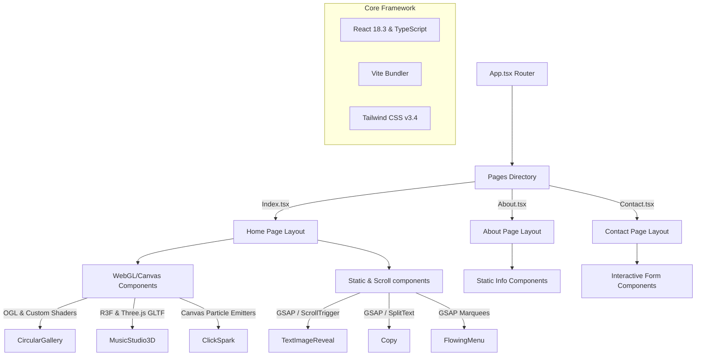

# Cultre Boat | Creative Agency & Digital Branding Studio

An immersive, high-performance creative agency homepage and digital studio web application designed to showcase talent, narrative storytelling, and advanced WebGL/3D animations.

---

## Overview

**Cultre Boat** is a premier digital branding studio and creative agency website designed to deliver an interactive, visually striking user experience. The application blends creative frontend development (WebGL, physics particle cursor systems, custom shaders, and 3D environment rendering) with a high-contrast cinematic visual aesthetic. 

- **Target Audience:** Chief Marketing Officers (CMOs), Brand Managers, Founders, Design Directors, and enterprises seeking premium design, bespoke brand strategy, and immersive 3D/WebGL experiences.
- **Business Purpose:** Position Cultre Boat as a premier, technologically advanced creative studio to capture high-value enterprise branding, creative development, and WebGL contract packages.
- **Maturity Level:** Production-grade frontend with localized state management and modular architecture, utilizing Supabase configurations for database client setup (schema integration pending).

---

## Features

### 1. Physics Scroll & Navigation
- **Smooth Physics Scrolling:** Global momentum scroll wrapper using **Lenis** to create friction-based inertial scrolling.
- **Scroll Anchor Hash Routing:** Seamless transition between page boundaries and internal ID selectors via the `ScrollToHashElement` component.
- **Staggered Mobile Menu:** Overlay navigation panel with staggering sliding panel layers and custom color schemes powered by GSAP timeline animations.

### 2. High-Impact Typography & Text Effects
- **GSAP Line/Word Split Text Animations:** Text elements wrapped in `Copy` components utilize GSAP's `SplitText` plugin to stagger line/word slides dynamically relative to scroll velocity.
- **GSAP Inline Image Text Reveals:** `TextImageReveal` animates inline image widths between text blocks dynamically via scrubbed scroll triggers, superimposed over a looping cinematic background video.

### 3. Interactive WebGL & 3D Visuals
- **Circular WebGL Cylinder Gallery:** Custom WebGL cylinder slider built with **OGL** that rotates mesh cards on a 3D cylindrical path. The shaders use signed distance functions (SDF) to round card edges and apply time-based noise waves mapping mouse gestures to rotation velocity.
- **3D Interactive Studio Environment:** Integrates a React Three Fiber (**R3F**) Canvas component (`MusicStudio3D.tsx`) to load and auto-rotate a customized 3D model (`scene.gltf`). Features point lights mimicking studio neon accents and OrbitControls.
- **Graceful WebGL Degradation:** Envelops WebGL/3D components under a custom React `ErrorBoundary` wrapper that degrades gracefully to high-contrast cinematic text layouts and image backups in the event of render failures or resource loading crashes.
- **Click Spark Physics Particles:** Implements a canvas particle emitter (`ClickSpark.tsx`) that triggers radial sparkles outward from mouse click coordinates.

### 4. Interactive Bento Grid & Services Showcase
- **Bento Grid Layout:** Prominently highlights services (Brand Strategy, Content Creation, Visual Design) with hover translation vectors.
- **Hover sliding Marquee Menu:** The `FlowingMenu` component tracks mouse entrance/exit edges (`top` or `bottom`) to slide a GSAP-animated marquee in and out matching mouse positions.

### 5. Multi-Category Inquiry Management
- **Contact Form Segment:** Contains interactive inquiry category buttons (Project Discussion, General Inquiry, Partnerships, Consultation) with toast message feedback powered by **Sonner**.

---

## Screens / Pages

- **Home Page (`/`):** The primary hub of the portal. Integrates the `Hero` section, the services `BentoSection`, the hover marquee `CategorySection`, the `GallerySection` (Dome Gallery), the interactive 3D studio `StudioShowcase`, the `ProductGrid`, and the interactive WebGL `CircularGallery`.
- **About Page (`/about`):** Detailed narrative detailing agency roots. Outlines core philosophy values (Culture-First Strategy, Radical Visual Craft, Interactive Innovation, Purpose-Built Design) and core disciplines list.
- **Contact Page (`/contact`):** An inquiry submission portal combining local state forms with social handle blocks and an engagement guarantee card.
- **Not Found Page (`*`):** A custom 404 container with a stylized redirect back to the home route.

---

## Architecture

Cultre Boat is built on a clean React separation of concerns model, strictly adhering to the architectural standards defined in the project's instructions:



### Key Responsibilities
- **Pages (`src/pages/*`):** Serve as containers that import and organize sections. They are clean and do not include direct layout definitions or style overrides, adhering to a strict **200-line layout code limit**.
- **WebGL / Creative Canvas (`src/components/WebGL/*` or inline WebGL files):** Handle custom 3D drawing, event listeners, and shader logic. They expose clean, simple React prop interfaces to the rest of the application.
- **UI System (`src/components/ui/*`):** Contains low-level primitives (buttons, inputs, tooltips, dialogs) derived from Radix primitives and styled via shadcn configurations.
- **Integrations (`src/integrations/*`):** Houses client instance initializers (such as the Supabase client wrapper).

---

## Folder Structure

The directory structure follows modular patterns:

```
cultre-boat-homepage-redesign-main/
├── .agents/                      # AI Agent workspace setup and rules files
│   └── skills/                   # Folder housing specific agent workflow skills
├── public/                       # Static public assets served from the root
│   ├── bg-video.mp4              # Dynamic cinematic background loop video
│   ├── scene.gltf                # 3D Music Studio scene file
│   ├── scene.bin                 # 3D Music Studio geometry buffer binary file
│   └── textures/                 # 3D Model texture resources
├── remotion/                     # Isolated sub-project for compiling video media
│   ├── scripts/                  # Bundling and rendering shell scripts
│   └── src/                      # React MainVideo compositions using Remotion
├── src/                          # Application source directory
│   ├── assets/                   # Compiled images, icons, and local visual assets
│   ├── components/               # React Layout and feature subcomponents
│   │   ├── ui/                   # Low-level Radix components (shadcn configurations)
│   │   ├── Header.tsx            # Global fixed header navbar
│   │   ├── Footer.tsx            # Global text footer block
│   │   ├── CircularGallery.tsx   # Custom WebGL cylinder carousel (OGL)
│   │   ├── DomeGallery.tsx       # CSS 3D Dome rotation gallery
│   │   └── ...                   # Page and layout components
│   ├── hooks/                    # Custom application React hooks
│   ├── integrations/             # Third-party configurations (e.g. Supabase)
│   ├── lib/                      # Shared utility code files
│   ├── pages/                    # Route layout page containers
│   └── test/                     # Vitest testing suite files
├── supabase/                     # Supabase settings folder
│   └── config.toml               # Config mapping local database project
├── agents.md                     # Single Source of Truth for assistant conventions
├── tailwind.config.ts            # Custom Tailwind configuration (theme & colors)
├── vite.config.ts                # Vite configuration file
└── package.json                  # Dependencies list and scripts
```

---

## Technology Stack

The application relies on these core technologies:

| Category | Library / Tool | Version | Description |
| :--- | :--- | :--- | :--- |
| **Core** | React | `^18.3.1` | View rendering framework |
| | TypeScript | `^5.8.3` | Strong-typing layer |
| | Vite | `^5.4.19` | High-performance dev server and compiler |
| **Styling** | Tailwind CSS | `^3.4.17` | Utility-first CSS framework |
| | PostCSS & Autoprefixer | - | CSS compilation and prefixing |
| | Tailwind CSS Animate | `^1.0.7` | UI transition extensions |
| **Animations** | GSAP | `^3.14.2` | Timeline sequences & SplitText reveals |
| | @gsap/react | `^2.1.2` | React wrapper hooks for GSAP animations |
| | Framer Motion | `^12.31.0` | Declarative page transition triggers |
| | @use-gesture/react | `^10.3.1` | Advanced gesture event tracking |
| | Lenis Scroll | `^1.0.42` | Inertial momentum smooth scroll |
| **WebGL & 3D** | Three.js | `0.160.0` | Core 3D engine |
| | React Three Fiber | `8.18.0` | React wrapper for Three.js render loops |
| | React Three Drei | `9.122.0` | Helper elements for Three.js canvases |
| | OGL | `^1.0.11` | High-performance minimal WebGL library |
| **State & APIs** | TanStack Query | `^5.83.0` | Server-state caching and fetching |
| | Supabase Client | `^2.95.3` | Backend database client provider |
| | React Hook Form | `^7.61.1` | Form state management |
| | Zod | `^3.25.76` | Data validation parsing schemas |
| **UI Components**| Radix UI / shadcn | - | Headless component primitives |
| | Sonner / Toaster | - | Application alert toasts |
| **Testing** | Vitest | `^3.2.4` | Testing runner |
| | jsdom | `^20.0.3` | Browser DOM emulation layer |

---

## Installation

### Prerequisites
- Install **Node.js** (v18 or higher recommended)
- Install **npm** or **Bun**

### Step-by-Step Setup
1. **Clone the Repository:**
   ```bash
   git clone <YOUR_GIT_URL>
   cd cultre-boat-homepage-redesign-main
   ```

2. **Install Dependencies:**
   ```bash
   npm install
   ```

3. **Start the Development Server:**
   ```bash
   npm run dev
   ```
   Open `http://localhost:8080` in your browser to view the application.

---

## Environment Variables

The project utilizes local environment variables loaded in Vite. Create a `.env` file in the project root:

```ini
# Supabase Configuration
VITE_SUPABASE_PROJECT_ID="ksyyxldychjegsqeupms"
VITE_SUPABASE_URL="https://ksyyxldychjegsqeupms.supabase.co"
VITE_SUPABASE_PUBLISHABLE_KEY="eyJhbGciOiJIUzI1NiIsInR5cCI6IkpXVCJ9..."
```

*Note: All variables prefixed with `VITE_` are exposed to the client-side code.*

---

## Local Development

Available npm scripts:

- `npm run dev`: Starts the local development server on `http://localhost:8080`
- `npm run build`: Compiles optimized assets and scripts into the `dist/` directory
- `npm run lint`: Scans TypeScript files using ESLint definitions
- `npm run test`: Executes the Vitest testing suite
- `npm run preview`: Spins up a local web server to preview production builds stored in `dist/`

---

## Build Process

The application is bundled using Vite with SWC compilation for React. When executing `npm run build`:
- Assets (images, background video, GLTF models) are optimized.
- Shaders and GSAP assets are transpiled.
- Javascript files are split into logical chunks:
  - `index-[hash].js`: Contains React framework, routing, and animations.
  - `MusicStudio3D-[hash].js`: Dynamically loads Three.js, R3F, and Drei resources to improve initial loading speed (lazy loading).

---

## Deployment

The application is configured to deploy directly to hosting platforms (e.g. Vercel, Netlify, or Lovable custom domains).
- **Custom Domains:** To connect a custom domain, navigate to Project Settings in the Lovable dashboard.
- **Production Routing:** Ensure your hosting provider is configured to rewrite all router requests back to `index.html` (e.g., via a `vercel.json` or `_redirects` file) to support HTML5 client-side pushState routing.

---

## Database Schema

The database client integrates with **Supabase Database**. 
- **Current Status:** *Needs Verification / Pending Migration*. 
- The current database schema definition (`src/integrations/supabase/types.ts`) has no public tables populated (`Tables: { [_ in never]: never }`).
- Interactive forms (like the contact section) utilize local React state handlers and toast notices. If database features are added, tables should be protected by Row Level Security (RLS) policies.

---

## API Documentation

- **External Integrations:** None.
- **Database Client:** Initialized in [client.ts](file:///c:/Users/zhenr/Desktop/cultre-boat-homepage-redesign-main/src/integrations/supabase/client.ts) using:
  ```typescript
  import { supabase } from "@/integrations/supabase/client";
  ```
- **Inquiry Submission Payload (Proposed):**
  - Name: `string` (Required)
  - Email: `string` (Required)
  - Organization: `string` (Optional)
  - Message: `string` (Required)
  - Inquiry Type: `string` (Default: "Project Discussion")

---

## Authentication Flow

Currently, the portal is a public marketing site and does not implement user login or authentication walls.
- Supabase Auth is enabled on the client wrapper instance (`persistSession: true`), but there are no routes that require restricted user sessions.

---

## State Management

- **UI & Layout States:** Handled via local React `useState` and `useRef` loops.
- **Server Cache:** Configured using **TanStack Query** (QueryClientProvider in `App.tsx`) to handle async queries or cache mutations.
- **WebGL Animation Speeds:** Rotation speed, target momentum, and coordinate translations are tracked in mutable React `useRef` properties. This bypasses React render loops, avoiding lag during render updates inside `requestAnimationFrame`.

---

## Services

- **Supabase Wrapper Service:** Initialized client instance pointing to `VITE_SUPABASE_URL` and `VITE_SUPABASE_PUBLISHABLE_KEY` with automatic auth refresh settings.

---

## Utilities

- **`cn(...inputs)`:** Combines **clsx** and **tailwind-merge** to resolve class names dynamically, supporting responsive state styles.
  ```typescript
  import { clsx, type ClassValue } from "clsx";
  import { twMerge } from "tailwind-merge";
  
  export function cn(...inputs: ClassValue[]) {
    return twMerge(clsx(inputs));
  }
  ```

---

## Scripts

### 1. Remotion Rendering Script
The folder `remotion/` houses a standalone utility configured with **Bun** to output high-fidelity video loops for background rendering.
- **Execution:** Runs `render-remotion.mjs` via Chromium.
- **Render flow:**
  ```javascript
  const bundled = await bundle({ entryPoint: "./src/index.ts" });
  await renderMedia({ composition, serveUrl: bundled, codec: "h264", outputLocation: "bg-video.mp4" });
  ```
- **Result:** The rendered MP4 video is copied to `public/bg-video.mp4` for use as a background resource.

---

## AI Agents & Skills

AI systems modifying this codebase must adhere to the rules defined in `agents.md`:

1. **Acknowledge and Read:** Confirm understanding of the guidelines before proposing modifications.
2. **Context Preservation:** Keep existing page sections intact unless explicitly requested.
3. **200-Line Limit:** Layout page containers (like `About.tsx` and `Contact.tsx`) must defer styling and logic to sub-components once they grow beyond 200 lines.
4. **WebGL Context Cleanups:** Custom loops, events, and geometries inside OGL or Three.js elements must be disposed of on unmount to avoid memory leaks.
5. **No Direct DOM Injection:** Avoid using `dangerouslySetInnerHTML`. If necessary, sanitize all input variables.

### Integrated Agent Skills
- **expo-api-routes, upgrading-expo, expo-dev-client:** Pre-configured skills located in the `.agents/skills` directory, providing settings for mobile/expo builds.

---

## Security Notes

- **Input Sanitization:** Contact form values are checked using local validation scripts.
- **Secrets Isolation:** No private API keys or database service roles are exposed. Environment variables reside in `.env`.
- **Database RLS Policies:** Ensure that any database tables added in the future have Row Level Security enabled.

---

## Performance Considerations

- **Frame Rate (60FPS):** Three.js position updates are mutated directly inside object refs. Updates to React state variables are avoided inside `useFrame` or rendering threads.
- **Lazy Loading (3D Assets):** Heavy 3D canvas components are imported dynamically via `React.lazy` and wrapped in React `Suspense` fallbacks:
  ```typescript
  const MusicStudio3D = lazy(() => import("./MusicStudio3D"));
  ```
- **Memory Disposals:** Event listeners and render loops inside OGL's cylindrical canvas (`CircularGallery.tsx`) are cleaned up on component unmount.
- **Image Compression:** All portfolio mockups and banners are compressed webp/jpg files to reduce layout shift and network latency.

---

## Known Issues

- **WebGL Canvas Fallback Warning:** The project bundles heavy Three.js resources. On older machines or platforms with hardware acceleration disabled, canvas loading might throw errors. These are handled gracefully by `ErrorBoundary`.
- **Large Bundles Warning:** Vite throws a bundle warning during build due to the size of Three.js. This is resolved by lazy-loading the canvas.

---

## Technical Debt

- **Supabase Table Mapping:** Database query code is not connected to any tables. Form actions are mock processes.
- **Unused shadcn Primitives:** The codebase includes several pre-installed shadcn components (like calendar, checkbox, sidebar) that are not currently in use by the main layout.

---

## Future Improvements

- **Interactive 3D Hotspots:** Map clicking vectors in `MusicStudio3D.tsx` to active popups detailing branding packages.
- **Headless CMS Connection:** Connect portfolio assets inside `CircularGallery` and `DomeGallery` to a remote database table in Supabase.
- **Blog & Career Sections:** Expand routing inside the About page to render blog feeds.

---

## Troubleshooting

### 1. 3D Studio Canvas is Blank
- **Cause:** WebGL context lost or GLTF loader failed to parse the local model `/scene.gltf`.
- **Solution:** Verify `/scene.gltf` and `/scene.bin` reside in the `public/` directory. Ensure the browser supports WebGL.

### 2. Page Doesn't Scroll Smoothly
- **Cause:** Multiple Lenis scroll instances initialized on the same container.
- **Solution:** Ensure only one root Lenis instance is active. The project configures it inside the `TextImageReveal` component.

### 3. Font Loading Delays
- **Cause:** Google Font styles in `index.css` block initial paint.
- **Solution:** Add `font-display: swap` to the imports or preconnect the Google Font links in `index.html`.

---

## Contributing

1. **Create a Branch:** `git checkout -b feature/amazing-feature`
2. **Commit Changes:** `git commit -m 'Add amazing feature'`
3. **Push to Branch:** `git push origin feature/amazing-feature`
4. **Open a Pull Request:** Submit for review.

---

## License

The code is private. 

### 3D Asset Attribution
- The 3D model used in the homepage studio showcase is based on:
  - **Title:** "Music studio" ([Sketchfab Link](https://sketchfab.com/3d-models/music-studio-a0c0ac7dbbea4e1cbf3d7beaa164a239))
  - **Author:** JuliaIce ([Sketchfab Profile](https://sketchfab.com/juliaice))
  - **License:** CC-BY-4.0 ([Creative Commons Attribution 4.0 International](http://creativecommons.org/licenses/by/4.0/))

---

## Appendix

### Complete Feature Inventory
- Momentum inertia smooth scroll (Lenis)
- Radial physics particle emitter (ClickSpark)
- CSS 3D spherical dome card rotation gallery (DomeGallery)
- Custom WebGL cylinder rotating cards (CircularGallery)
- Three.js WebGL 3D Model interactive viewport (MusicStudio3D)
- Text split letter slide-up reveal triggers (Copy / SplitText)
- Text line splits with expanding image slots (TextImageReveal)
- Hover sliding marquee reveal menu (FlowingMenu)
- Inquiry category selectors & contact form submission logic (ContactFormSection)
- Staggered mobile nav links (StaggeredMenu)

### Complete Route Inventory
- `/` - Renders `pages/Index.tsx`
- `/about` - Renders `pages/About.tsx`
- `/contact` - Renders `pages/Contact.tsx`
- `*` - Renders `pages/NotFound.tsx`

### Complete Component Inventory
- **WebGL / Creative:**
  - `src/components/CircularGallery.tsx`
  - `src/components/DomeGallery.tsx`
  - `src/components/MusicStudio3D.tsx`
  - `src/components/ClickSpark.tsx`
- **Text & Scroll Animations:**
  - `src/components/Copy.tsx`
  - `src/components/TextImageReveal.tsx`
  - `src/components/FlowingMenu.tsx`
- **Core Layout & Sections:**
  - `src/components/Header.tsx`
  - `src/components/Footer.tsx`
  - `src/components/Hero.tsx`
  - `src/components/BentoSection.tsx`
  - `src/components/CategorySection.tsx`
  - `src/components/GallerySection.tsx`
  - `src/components/StudioShowcase.tsx`
  - `src/components/ProductGrid.tsx`
  - `src/components/ProductCard.tsx`
  - `src/components/StaggeredMenu.tsx`
  - `src/components/ScrollToHashElement.tsx`
  - `src/components/ErrorBoundary.tsx`
- **Subcomponents (About / Contact):**
  - `src/components/AboutHero.tsx`
  - `src/components/CompanyStory.tsx`
  - `src/components/MissionVision.tsx`
  - `src/components/CoreValues.tsx`
  - `src/components/Expertise.tsx`
  - `src/components/ContactHero.tsx`
  - `src/components/ContactFormSection.tsx`
  - `src/components/NavLink.tsx`

### Complete Environment Variable Inventory
- `VITE_SUPABASE_PROJECT_ID`: ID mapping the Supabase database instance.
- `VITE_SUPABASE_URL`: API gateway endpoint url for Supabase operations.
- `VITE_SUPABASE_PUBLISHABLE_KEY`: Client publishable key used for client validation queries.

### Complete Dependency Inventory
- `@gsap/react`: `^2.1.2`
- `@hookform/resolvers`: `^3.10.0`
- `@radix-ui/react-accordion`: `^1.2.11`
- `@radix-ui/react-alert-dialog`: `^1.1.14`
- `@radix-ui/react-aspect-ratio`: `^1.1.7`
- `@radix-ui/react-avatar`: `^1.1.10`
- `@radix-ui/react-checkbox`: `^1.3.2`
- `@radix-ui/react-collapsible`: `^1.1.11`
- `@radix-ui/react-context-menu`: `^2.2.15`
- `@radix-ui/react-dialog`: `^1.1.14`
- `@radix-ui/react-dropdown-menu`: `^2.1.15`
- `@radix-ui/react-hover-card`: `^1.1.14`
- `@radix-ui/react-label`: `^2.1.7`
- `@radix-ui/react-menubar`: `^1.1.15`
- `@radix-ui/react-navigation-menu`: `^1.2.13`
- `@radix-ui/react-popover`: `^1.1.14`
- `@radix-ui/react-progress`: `^1.1.7`
- `@radix-ui/react-radio-group`: `^1.3.7`
- `@radix-ui/react-scroll-area`: `^1.2.9`
- `@radix-ui/react-select`: `^2.2.5`
- `@radix-ui/react-separator`: `^1.1.7`
- `@radix-ui/react-slider`: `^1.3.5`
- `@radix-ui/react-slot`: `^1.2.3`
- `@radix-ui/react-switch`: `^1.2.5`
- `@radix-ui/react-tabs`: `^1.1.12`
- `@radix-ui/react-toast`: `^1.2.14`
- `@radix-ui/react-toggle`: `^1.1.9`
- `@radix-ui/react-toggle-group`: `^1.1.10`
- `@radix-ui/react-tooltip`: `^1.2.7`
- `@react-three/drei`: `9.122.0`
- `@react-three/fiber`: `8.18.0`
- `@studio-freight/lenis`: `^1.0.42`
- `@supabase/supabase-js`: `^2.95.3`
- `@tanstack/react-query`: `^5.83.0`
- `@types/three`: `0.160.0`
- `@use-gesture/react`: `^10.3.1`
- `class-variance-authority`: `^0.7.1`
- `clsx`: `^2.1.1`
- `cmdk`: `^1.1.1`
- `date-fns`: `^3.6.0`
- `embla-carousel-react`: `^8.6.0`
- `framer-motion`: `^12.31.0`
- `gsap`: `^3.14.2`
- `input-otp`: `^1.4.2`
- `lucide-react`: `^0.462.0`
- `next-themes`: `^0.3.0`
- `ogl`: `^1.0.11`
- `react`: `^18.3.1`
- `react-day-picker`: `^8.10.1`
- `react-dom`: `^18.3.1`
- `react-hook-form`: `^7.61.1`
- `react-resizable-panels`: `^2.1.9`
- `react-router-dom`: `^6.30.1`
- `recharts`: `^2.15.4`
- `sonner`: `^1.7.4`
- `tailwind-merge`: `^2.6.0`
- `tailwindcss-animate`: `^1.0.7`
- `three`: `0.160.0`
- `vaul`: `^0.9.9`
- `zod`: `^3.25.76`
